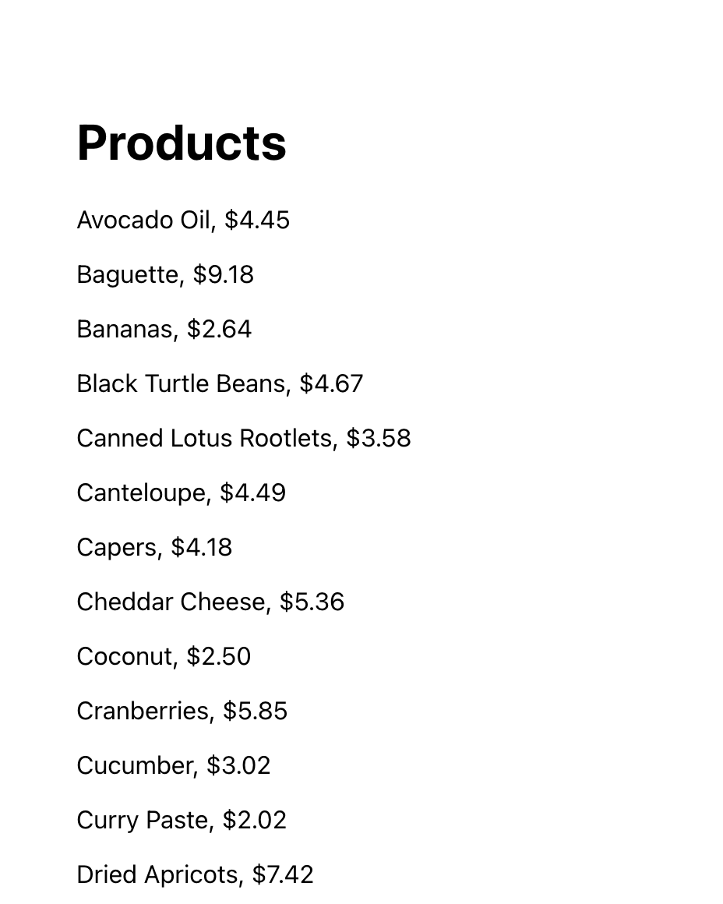

# Displaying products

Now that your back end is tested, you can work on the front end. In this part
you'll display all of the products from the store:



You don't have to worry about making the style beautiful. Basic styles are fine.
This way you can concentrate on understanding how you can use React to call an
API.

Start with create-react-app:

```sh
npx create-react-app front-end
```

You probably want to do this at the top level of your folder for this lab. Since
create-react-app creates its own git configuration, be sure to remove this:

```sh
rm -rf front-end/.git
```

**Be sure to use this command carefully. Don't remove the .git folder for your
entire lab, just for the front end.**

## Proxying requests for the API

To proxy API requests to the server, add this line to the `package.json` that
was created by create-react-app for your front-end code.  Also add the homepage directive so that your app is relocatable:

```
  "proxy": "http://localhost:3000",
  "homepage": ".",
```

## Structure of the app

You will want to use the top level App() component in `App.js` to fetch all of
the products and store them in an array.

- Error.js -- You probably want a separate error component in `Error.js` to
  display errors, like we have shown you in previous activities. This enables
  all components to have a single place where they report errors.

- Product.js -- You probably want a separate component that displays a single
product.

## App.js

In App.js, you can store all of the state for your application, using
`useState()`. This should include an array of products.

Write a function that fetches the products from the server and stores them in
this state variable.

To fetch the products when the page is first rendered, setup `useEffect()` to
call your function that fetches products. Be sure to use an empty dependency
array, so it will run only once.

In the render method, use `products.map()` to loop through the products, using
the Product component from Product.js.

You can see examples of how to do this from prior activities.

## Product.js

In Product.js, you can have a function whose render method displays the product
name and price. You will want to pass one prop to this component ```<Product product={product} setError={setError} updateCart={updateCart} />```:

- product -- a product object

## Error.js

In Error.js, you can have function whose render method displays the error given
to it by a prop. ```<Error error={error} />```

## Debugging

Be sure to use the browser console and the network tab in the developer tools to
check for errors when communicating with your server's API.
