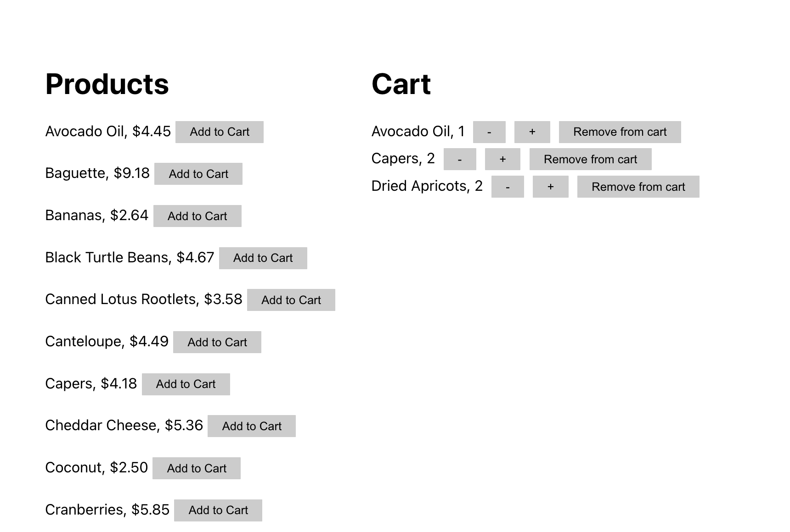

# Handling the shopping cart

Now it is time to develop the shopping cart. want to design something like this:



Again, don't worry too much about style. You want the following buttons:

- `Add to cart`, to add an item to cart
- `Minus`, to decrease the quantity of an item in the cart
- `Plus`, to increase the quantity of an item in the cart
- `Remove from cart`, to delete an item in the cart

## Adding items to the cart

Add a function to your `Product()` component that adds a product to the cart
using the API -- POST `/api/cart/:productID`.

Next, put an add to cart button next to the product. It should have an `onClick`
attribute that calls your `addToCart` method:

```js
onClick={e => addToCart(product.id)}
```

Notice how you need to pass a _function_ to `onClick`. The function takes an
event object, `e`, and then ignores it and calls `addToCart` with the product
ID`.

Be sure to test this once you have it setup. You can verify that the method to
add an item to the cart is calling the API, and that the API call is successful,
using the network tab in the browser developer tools.

## Getting the cart

Add a function to `App()` that gets the cart from the server and stores it in a
state variable.

You can call `useEffect()` to be sure that your `getCart()` function is called
when the page loads. You will want to setup a boolean state variable -- e.g. you
can call it `update` -- that gets set to true when the cart needs to be
refreshed. See previous activities for an example of this pattern.

_Note:_ You should have already call `useEffect()` to fetch the products. Here
you will call `useEffect()` a second time to fetch the cart. And this time you
need a dependency on the `update` state variable so that the cart is refreshed
every time this state variable is set to true.

You can verify that the cart is being fetched by using the network tab in the
browser developer tools.

## Displaying the cart

Add a cart component in `Cart.js`. You can pass the cart array to this component
from `App()`. The component then loops through the cart and displays the items.
After you add items to the cart, you can refresh the page and see the cart
displaying.

## Updating the cart

When you add items to the cart, you want to have the cart automatically refresh.
You shouldn't have to refresh the page manually!

To do this, you need to set the boolean state variable -- update -- to true. How
can you do this from the `Cart` component when that state variable is in the
`App` component? Simple -- just write a method in `App` called `updateCart()`
that sets the state variable to true, and then pass this method to `Cart` as a
prop.

Once you do this, then inside your `addToCart()` method you can call
`updateCart()`. This will cause the `App` component to rerun `useEffect()` if
you have set its dependencies properly. This should call your `getCart()`
function, which updates the cart state, which causes the cart to be re-rendered
with the new items you just added.

## Updating and deleting items

Now you can add three more functions to `Cart.js` for the following: (a)
decreasing the quantity by one, (b) increasing the quantity by one, and (c)
deleting the item from the cart. Each needs a button with an `onClick`
attribute. Each of these functions should likewise call `updateCart()` so that
the cart will be automatically refreshed.

## Congrats

If you have made it this far, then you have a working store with a shopping
cart!
